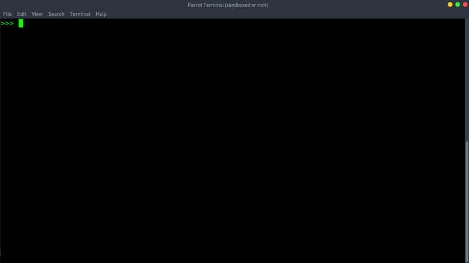

# Burpee
## About
A python module to extract headers and POST data from a file containing intercepted HTTP request.

Let's say we have a file named <b>request.txt</b> that contains following HTTP request:
```
POST /user/follow HTTP/1.1
Host: www.website.com
User-Agent: some user agent
Accept: application/json, text/plain, */*
Accept-Language: pl,en-US;q=0.7,en;q=0.3
Referer: https://www.website.com/users/12345/profile
Content-Type: application/json;charset=utf-8
X-CSRF-TOKEN: Ab1/2cde3fGH
Content-Length: 27
Cookie: some-cookie=;
DNT: 1
Connection: close

{"targetUser":"12345"}
```
To send the above request using inbuilt functions of python like requests.get(), we need to explicitely specify each of the headers and values manually.

Here <b>Burpee</b> comes to save the day. It simply accepts name of the file containing the HTTP request as parameter and returns two things:
* Dictionary: Headers and their respective values 
* String: Supplied Post data

## Screenshot:


## Demonstration:


As demonstrated in the above proofs, once we get dictionary of headers and post data, we can simply pass these headers and post data to functions like requests.get() , requests.post() etc.
